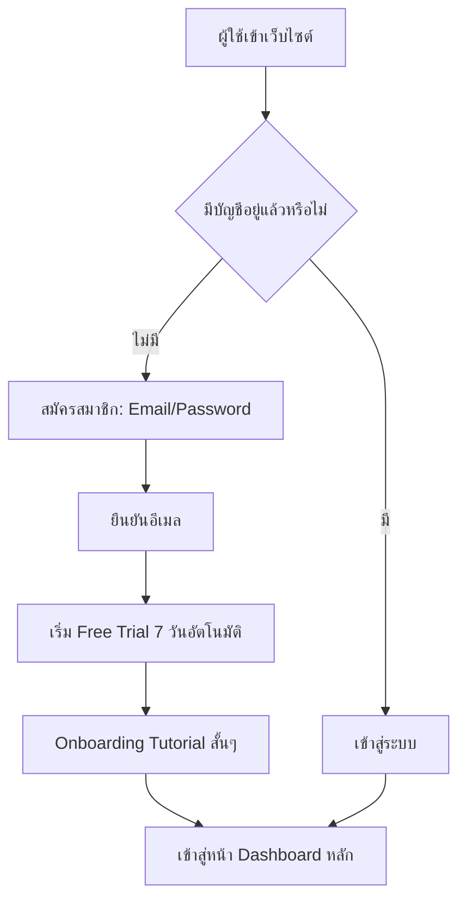
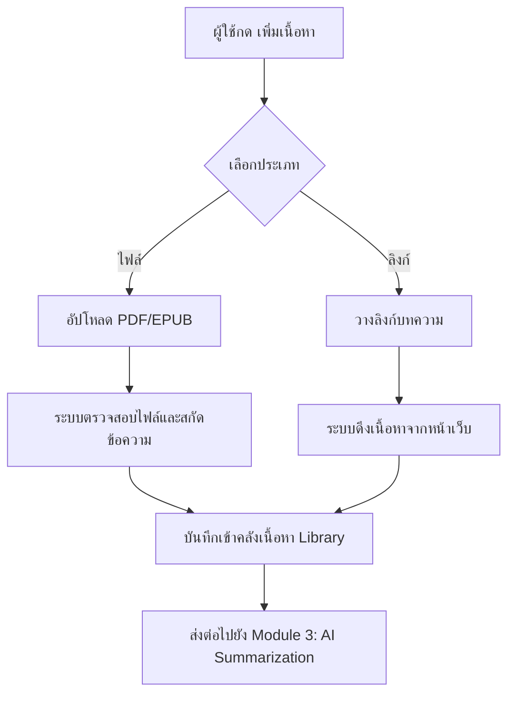
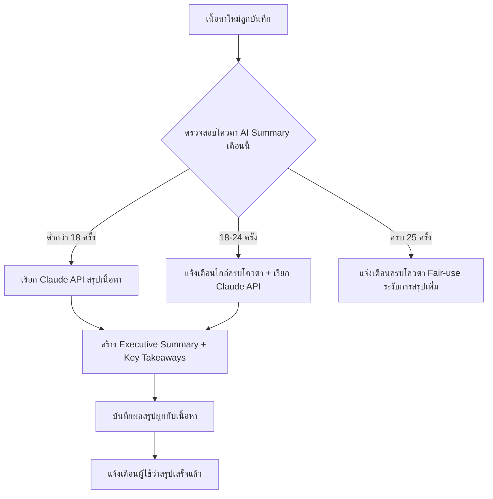
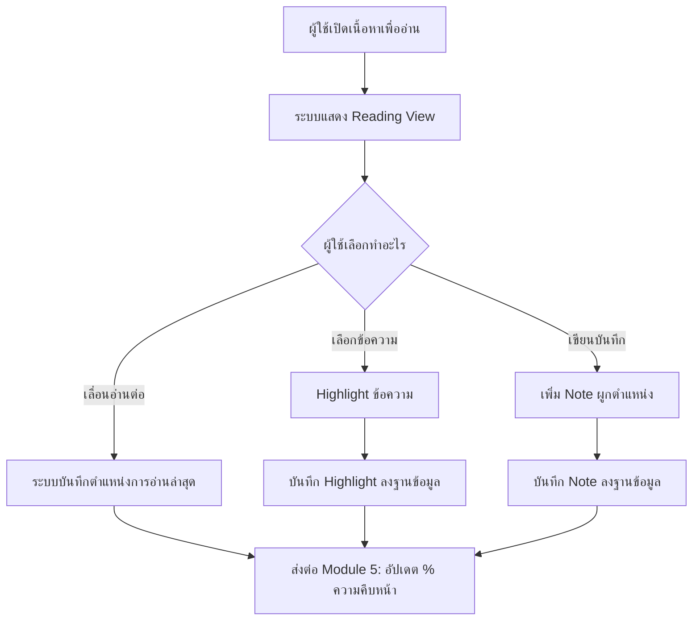
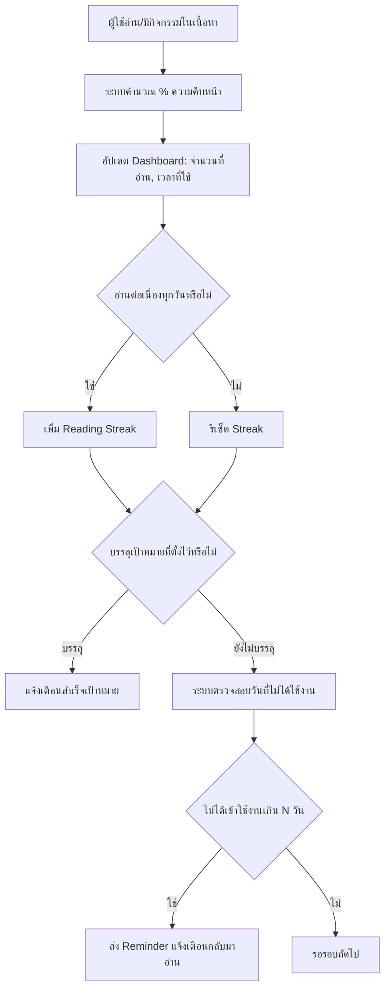
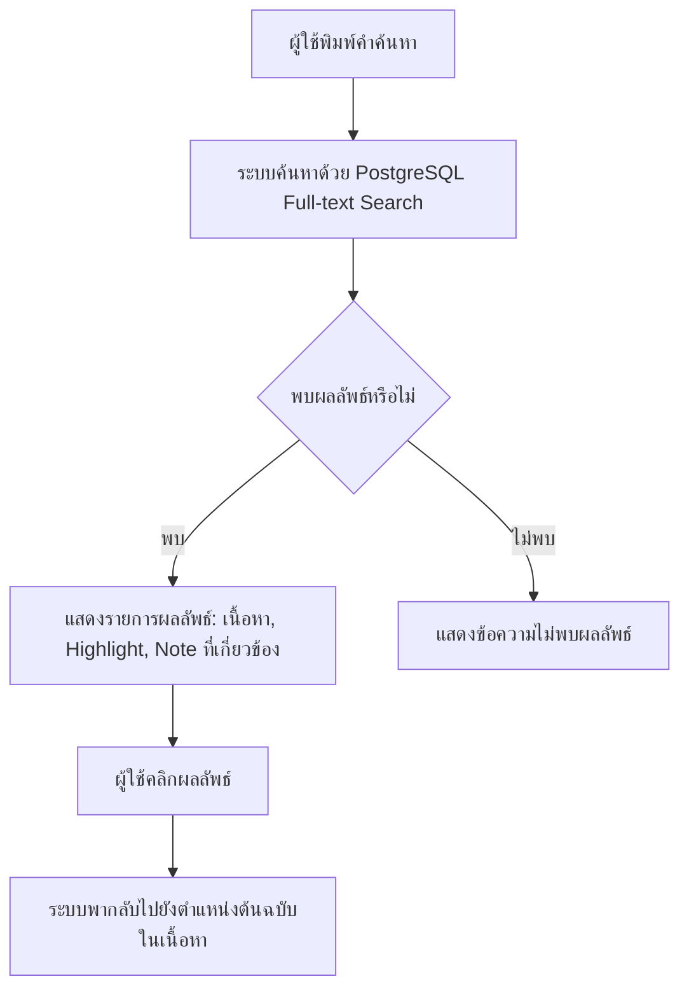
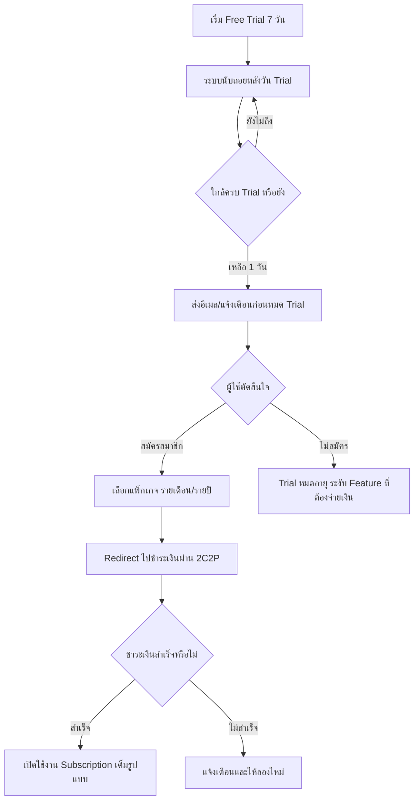
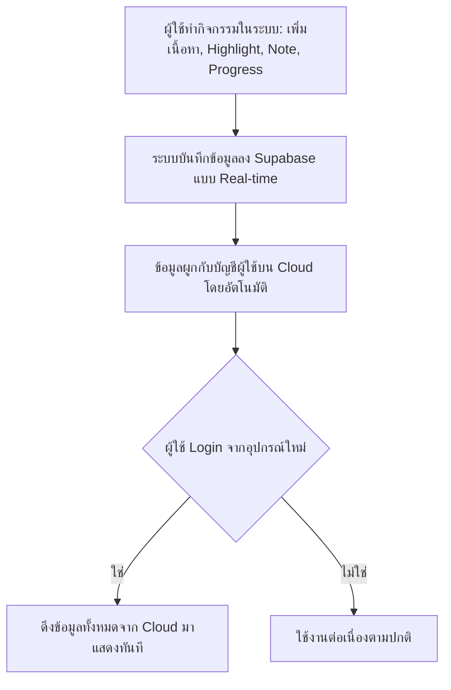
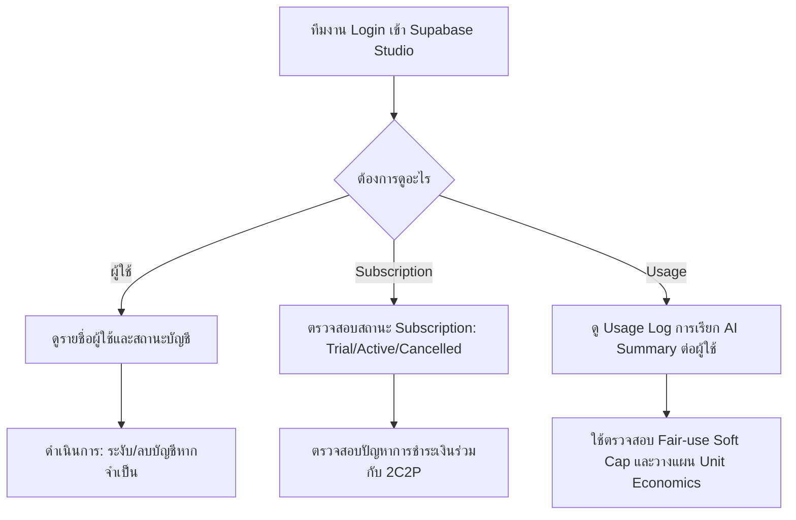
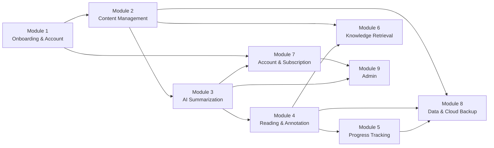

# QriboRead — Business Flow (PoC)

เอกสารนี้อธิบาย Business Flow และ Use Case ของแต่ละ Module ตาม Scope ที่กำหนดไว้ใน Requirement Document (PoC, Web-only)

Flowchart ในเอกสารนี้เขียนด้วย Mermaid Syntax — เปิดดูแบบ Rendered ได้ผ่าน GitHub, GitLab, Notion, Typora หรือ Mermaid Live Editor

---

## Module 1: Onboarding & Account

### Business Flow

### Use Case

| Use Case | UC1.1 สมัครสมาชิกใหม่ |
|---|---|
| Actor | ผู้ใช้ใหม่ (Guest) |
| Precondition | ยังไม่มีบัญชีในระบบ |
| Main Flow | 1. กรอกอีเมล/รหัสผ่าน → 2. ระบบส่งอีเมลยืนยัน → 3. ผู้ใช้กดยืนยัน → 4. ระบบสร้างบัญชี + เริ่ม Free Trial 7 วันทันที |
| Postcondition | บัญชีถูกสร้าง สถานะ = Trial Active, วันหมด Trial ถูกบันทึก |
| Exception | อีเมลซ้ำในระบบ → แจ้งเตือนให้เข้าสู่ระบบแทน |

| Use Case | UC1.2 เข้าสู่ระบบ |
|---|---|
| Actor | ผู้ใช้ที่มีบัญชีอยู่แล้ว |
| Precondition | มีบัญชีในระบบแล้ว |
| Main Flow | 1. กรอกอีเมล/รหัสผ่าน → 2. ระบบตรวจสอบ → 3. เข้าสู่ Dashboard |
| Postcondition | Session ผู้ใช้ถูกสร้าง |
| Exception | รหัสผ่านผิด → แจ้งเตือน / ลืมรหัสผ่าน → ส่งลิงก์ Reset ทางอีเมล |

---

## Module 2: Content Management

### Business Flow

### Use Case

| Use Case | UC2.1 อัปโหลดไฟล์ PDF/EPUB |
|---|---|
| Actor | ผู้ใช้ที่ Login แล้ว |
| Precondition | มีไฟล์ PDF/EPUB ที่ตนมีสิทธิ์ใช้งาน |
| Main Flow | 1. เลือกไฟล์ → 2. ระบบตรวจสอบขนาด/ประเภทไฟล์ → 3. สกัดข้อความจากไฟล์ → 4. บันทึกเข้า Library → 5. ตั้งสถานะ "รอสรุป" |
| Postcondition | เนื้อหาปรากฏใน Library พร้อม Trigger AI Summary |
| Exception | ไฟล์เสียหาย/สกัดข้อความไม่ได้ → แจ้งเตือนผู้ใช้ให้ลองไฟล์อื่น |

| Use Case | UC2.2 เพิ่มบทความจากลิงก์ |
|---|---|
| Actor | ผู้ใช้ที่ Login แล้ว |
| Precondition | มี URL บทความที่ต้องการเพิ่ม |
| Main Flow | 1. วาง URL → 2. ระบบดึงเนื้อหาหน้าเว็บ (Web Scraping) → 3. บันทึกเข้า Library → 4. ตั้งสถานะ "รอสรุป" |
| Postcondition | เนื้อหาปรากฏใน Library พร้อม Trigger AI Summary |
| Exception | เว็บไซต์บล็อกการดึงข้อมูล/ URL ใช้งานไม่ได้ → แจ้งเตือนผู้ใช้ |

| Use Case | UC2.3 ดูคลังเนื้อหา (Library) |
|---|---|
| Actor | ผู้ใช้ที่ Login แล้ว |
| Precondition | มีเนื้อหาอย่างน้อย 1 รายการในระบบ |
| Main Flow | 1. เข้าหน้า Library → 2. ระบบแสดงรายการเนื้อหาทั้งหมดพร้อมสถานะความคืบหน้า |
| Postcondition | ผู้ใช้เห็นภาพรวมเนื้อหาทั้งหมด |
| Exception | ไม่มีเนื้อหา → แสดงหน้าว่างพร้อม CTA ให้เพิ่มเนื้อหา |

---

## Module 3: AI Summarization

> Core Value: "ช่วยอ่านแทน" — ใช้ Claude API

### Business Flow

### Use Case

| Use Case | UC3.1 สร้าง AI Summary อัตโนมัติ |
|---|---|
| Actor | ระบบ (Background Job), ผู้ใช้ (ผู้รอผลลัพธ์) |
| Precondition | เนื้อหาถูกบันทึกในสถานะ "รอสรุป" และผู้ใช้ยังไม่ครบโควตา 25 ครั้ง/เดือน |
| Main Flow | 1. ระบบตรวจสอบโควตาคงเหลือ → 2. เรียก Claude API พร้อมเนื้อหา → 3. รับผล Executive Summary + Key Takeaways → 4. บันทึกผลลัพธ์ → 5. แจ้งเตือนผู้ใช้ |
| Postcondition | เนื้อหามีสถานะ "สรุปแล้ว" ผู้ใช้เปิดดูได้ |
| Exception | Claude API Error/Timeout → Retry อัตโนมัติ 1 ครั้ง แล้วแจ้งผู้ใช้หากยังไม่สำเร็จ |

| Use Case | UC3.2 แจ้งเตือนใกล้ครบโควตา Fair-use |
|---|---|
| Actor | ผู้ใช้ที่ใช้ AI Summary ครั้งที่ 18 ขึ้นไปในเดือนนั้น |
| Precondition | ผู้ใช้เรียก AI Summary ครั้งที่ 18-24 ของเดือน |
| Main Flow | 1. ระบบตรวจนับจำนวนครั้งสะสม → 2. แสดงข้อความแจ้งเตือน "เหลือ AI Summary อีก X ครั้งในเดือนนี้" |
| Postcondition | ผู้ใช้รับทราบโควตาคงเหลือ |
| Exception | - |

| Use Case | UC3.3 ครบโควตา Fair-use Soft Cap |
|---|---|
| Actor | ผู้ใช้ที่เรียก AI Summary ครบ 25 ครั้งในเดือนนั้น |
| Precondition | ใช้ AI Summary ครบ 25 ครั้งแล้ว |
| Main Flow | 1. ระบบระงับการเรียก AI Summary เพิ่ม → 2. แจ้งเตือนผู้ใช้พร้อมวันที่โควตาจะรีเซ็ต |
| Postcondition | ผู้ใช้ยังใช้ Feature อื่นได้ปกติ (Highlight, Note, Tracker) ยกเว้น AI Summary |
| Exception | - |

---

## Module 4: Reading & Annotation

### Business Flow

### Use Case

| Use Case | UC4.1 Highlight ข้อความ |
|---|---|
| Actor | ผู้ใช้ขณะอ่านเนื้อหา |
| Precondition | กำลังเปิดเนื้อหาในโหมดอ่าน |
| Main Flow | 1. เลือก (Select) ข้อความ → 2. กด Highlight → 3. ระบบบันทึกตำแหน่งอ้างอิง + ข้อความที่เลือก |
| Postcondition | Highlight ปรากฏถาวรในเนื้อหานั้น และแสดงในรายการ Highlight ทั้งหมด |
| Exception | เลือกข้อความในรูปภาพ/ส่วนที่สกัดไม่ได้ → ปุ่ม Highlight ไม่ทำงาน |

| Use Case | UC4.2 เขียน Note ผูกตำแหน่ง |
|---|---|
| Actor | ผู้ใช้ขณะอ่านเนื้อหา |
| Precondition | กำลังเปิดเนื้อหาในโหมดอ่าน |
| Main Flow | 1. เลือกตำแหน่งในเนื้อหา → 2. กดเพิ่ม Note → 3. พิมพ์ข้อความ → 4. บันทึก |
| Postcondition | Note ผูกกับตำแหน่งนั้น เรียกดูภายหลังได้ |
| Exception | - |

| Use Case | UC4.3 ดูรายการ Highlight/Note ทั้งหมด |
|---|---|
| Actor | ผู้ใช้ |
| Precondition | มี Highlight/Note อย่างน้อย 1 รายการ |
| Main Flow | 1. เข้าหน้า "บันทึกของฉัน" → 2. ระบบแสดงรายการทั้งหมด พร้อมลิงก์กลับไปตำแหน่งต้นฉบับ |
| Postcondition | ผู้ใช้เห็นภาพรวมความรู้ที่บันทึกไว้ทั้งหมด |
| Exception | ไม่มีข้อมูล → แสดงหน้าว่าง |

---

## Module 5: Progress Tracking

### Business Flow

### Use Case

| Use Case | UC5.1 ตั้งเป้าหมายการอ่าน |
|---|---|
| Actor | ผู้ใช้ |
| Precondition | Login แล้ว |
| Main Flow | 1. เข้าหน้าตั้งเป้าหมาย → 2. กำหนดจำนวนเล่ม/บทความต่อเดือน → 3. บันทึก |
| Postcondition | ระบบเริ่มติดตามความคืบหน้าเทียบเป้าหมายที่ตั้ง |
| Exception | - |

| Use Case | UC5.2 รับการแจ้งเตือนกลับมาอ่าน (Reminder) |
|---|---|
| Actor | ผู้ใช้ที่ไม่ได้เข้าใช้งานติดต่อกันเกินเกณฑ์ที่กำหนด |
| Precondition | ผู้ใช้เปิดรับการแจ้งเตือน (Email/Web Push) |
| Main Flow | 1. ระบบตรวจสอบวันที่ Login ล่าสุด → 2. หากเกินเกณฑ์ ส่งการแจ้งเตือน |
| Postcondition | ผู้ใช้ได้รับการแจ้งเตือนให้กลับมาใช้งาน |
| Exception | ผู้ใช้ปิดการแจ้งเตือนไว้ → ไม่ส่ง |

| Use Case | UC5.3 ดู Dashboard ภาพรวม |
|---|---|
| Actor | ผู้ใช้ |
| Precondition | Login แล้ว |
| Main Flow | 1. เข้าหน้า Dashboard → 2. ระบบแสดงจำนวนที่อ่าน, เวลาที่ใช้, Streak, ความคืบหน้าเทียบเป้าหมาย |
| Postcondition | ผู้ใช้เห็นภาพรวมพฤติกรรมการเรียนรู้ของตนเอง |
| Exception | - |

---

## Module 6: Knowledge Retrieval (Search)

### Business Flow

### Use Case

| Use Case | UC6.1 ค้นหาความรู้ด้วย Keyword |
|---|---|
| Actor | ผู้ใช้ |
| Precondition | มีเนื้อหา/Highlight/Note ในระบบ |
| Main Flow | 1. พิมพ์คำค้นหาในช่อง Search → 2. ระบบค้นหาข้ามเนื้อหาทั้งหมดของผู้ใช้ → 3. แสดงผลลัพธ์เรียงตามความเกี่ยวข้อง |
| Postcondition | ผู้ใช้เห็นรายการผลลัพธ์พร้อมลิงก์กลับต้นฉบับ |
| Exception | ไม่พบผลลัพธ์ → แนะนำให้ลองคำค้นอื่น |

---

## Module 7: Account & Subscription

### Business Flow

### Use Case

| Use Case | UC7.1 สมัคร Subscription หลังจบ Free Trial |
|---|---|
| Actor | ผู้ใช้ที่ Trial ใกล้หมดอายุหรือหมดแล้ว |
| Precondition | บัญชีอยู่ในสถานะ Trial |
| Main Flow | 1. เลือกแพ็กเกจ (รายเดือน/รายปี) → 2. Redirect ไป 2C2P → 3. กรอกข้อมูลชำระเงิน → 4. ระบบยืนยันผลชำระเงิน → 5. เปิดใช้งาน Subscription |
| Postcondition | สถานะบัญชีเปลี่ยนเป็น Active Subscriber |
| Exception | ชำระเงินไม่สำเร็จ → แจ้งเตือนพร้อมปุ่มลองใหม่ |

| Use Case | UC7.2 Trial หมดอายุโดยไม่สมัครสมาชิก |
|---|---|
| Actor | ผู้ใช้ที่ไม่สมัครหลัง Trial ครบ 7 วัน |
| Precondition | Trial ครบกำหนดแล้ว |
| Main Flow | 1. ระบบตรวจสอบวันหมด Trial → 2. ระงับ Feature ที่ต้องจ่ายเงิน (คงเหลือดูข้อมูลเดิมได้ แต่เพิ่มเนื้อหา/AI Summary ใหม่ไม่ได้) |
| Postcondition | สถานะบัญชีเปลี่ยนเป็น Trial Expired |
| Exception | - |

| Use Case | UC7.3 ยกเลิก Subscription |
|---|---|
| Actor | ผู้ใช้ที่เป็น Active Subscriber |
| Precondition | มี Subscription Active อยู่ |
| Main Flow | 1. เข้าหน้าตั้งค่าบัญชี → 2. กดยกเลิก Subscription → 3. ระบบยืนยันการยกเลิก → 4. Subscription ใช้งานได้ถึงวันหมดรอบบิลปัจจุบัน |
| Postcondition | สถานะเปลี่ยนเป็น Cancelled (มีผลหลังจบรอบบิล) |
| Exception | - |

---

## Module 8: Data & Cloud Backup

### Business Flow

### Use Case

| Use Case | UC8.1 บันทึกข้อมูลอัตโนมัติขึ้น Cloud |
|---|---|
| Actor | ระบบ (Background) |
| Precondition | ผู้ใช้ทำกิจกรรมใดๆ ในระบบ |
| Main Flow | 1. ทุกการเปลี่ยนแปลงข้อมูล (เพิ่มเนื้อหา/Highlight/Note/Progress) ถูกบันทึกลง Supabase ทันที เพราะเป็น Web App ที่ทำงานผ่าน Cloud โดยตรง |
| Postcondition | ไม่มีความเสี่ยงข้อมูลสูญหายจากอุปกรณ์ เพราะไม่มีการเก็บข้อมูลไว้ที่เครื่องผู้ใช้เป็นหลัก |
| Exception | Connection หลุดระหว่างบันทึก → ระบบแจ้งเตือนและลองบันทึกซ้ำอัตโนมัติ |

---

## Module 9: Admin (Supabase Studio)

### Business Flow

### Use Case

| Use Case | UC9.1 ตรวจสอบสถานะ Subscription ของผู้ใช้ |
|---|---|
| Actor | ทีมงาน (Admin) |
| Precondition | มีสิทธิ์เข้าถึง Supabase Studio |
| Main Flow | 1. Login เข้า Supabase Studio → 2. Query ตาราง Subscription → 3. ตรวจสอบสถานะรายบัญชี |
| Postcondition | ทราบสถานะ Subscription ปัจจุบันของผู้ใช้แต่ละราย |
| Exception | - |

| Use Case | UC9.2 ตรวจสอบ Usage Log การใช้ AI Summary |
|---|---|
| Actor | ทีมงาน (Admin) |
| Precondition | มีสิทธิ์เข้าถึง Supabase Studio |
| Main Flow | 1. Query ตาราง AI Summary Usage → 2. ดูจำนวนครั้งต่อผู้ใช้ต่อเดือน → 3. เปรียบเทียบกับ Soft Cap 25 ครั้ง |
| Postcondition | ทราบพฤติกรรมการใช้งานจริงเพื่อปรับ Unit Economics |
| Exception | - |

---

## หมายเหตุ: Logging เป็น Cross-cutting Concern

ทุก Module ด้านบนที่มีช่อง **Exception** ในตาราง Use Case ให้ถือเป็นหลักการว่า: **เมื่อ Exception เกิดขึ้นจริง ระบบต้องบันทึกลง `error_log` เสมอ** (พร้อม Service ที่เกิด, ข้อความ Error, และเวลาที่เกิด) และ **เมื่อ Flow หลักสำเร็จ ระบบควรบันทึกลง `event_log`** เพื่อใช้ติดตาม KPI — ไม่ได้เขียนซ้ำในทุก Use Case ด้านบนเพื่อไม่ให้เอกสารยาวเกินไป แต่เป็นมาตรฐานที่ใช้กับทุก Module โดยไม่มีข้อยกเว้น รายละเอียดทางเทคนิคดูได้ที่ `AI-Reading-Learning-Hub-System-Architecture.md` หัวข้อ "Logging & Observability" และโครงสร้างตารางที่ `AI-Reading-Learning-Hub-Database-Design.md`

## ภาพรวมความเชื่อมโยงระหว่าง Module

