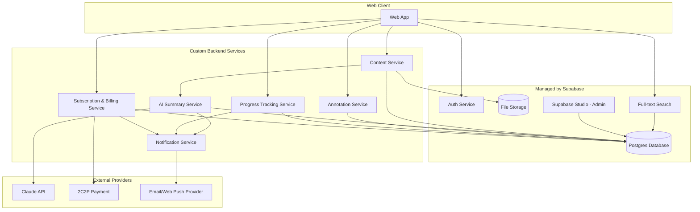

# AI Reading & Learning Hub — Service Architecture (PoC)

เอกสารนี้แปลง Business Flow (9 Module) ให้เป็น Service ทางเทคนิคที่ชัดเจน เพื่อให้ทีม Dev รู้ว่าอะไร **ต้องเขียนเอง (Custom)** และอะไร **ใช้ของ Platform สำเร็จรูป (Managed)** — ลดการสร้าง Service ซ้ำซ้อนโดยไม่จำเป็น ตามหลักการควบคุมต้นทุนของ PoC

---

## ภาพรวม Service ทั้งหมด

| # | Service | ประเภท | เทคโนโลยี/ผู้ให้บริการ | ต้องเขียนโค้ดเองแค่ไหน |
|---|---|---|---|---|
| 1 | Auth Service | Managed | Supabase Auth | แทบไม่ต้องเขียนเอง — ใช้ SDK สำเร็จรูป |
| 2 | Content Service | Custom | Supabase Storage + Postgres + Backend Function | ต้องเขียน Logic การอัปโหลด/สกัดข้อความ/Web Scraping |
| 3 | AI Summary Service | Custom | Claude API + Supabase Function | ต้องเขียน Prompt, Quota Logic, เรียก API |
| 4 | Annotation Service | Custom (เบา) | Supabase Postgres + Backend Function | CRUD ธรรมดา ผูก Foreign Key กับ Content |
| 5 | Progress Tracking Service | Custom (เบา) | Supabase Postgres + Backend Function | คำนวณ % และ Streak เป็น Logic เพิ่มเติม |
| 6 | Notification Service | Custom (บางส่วน) | Email (เช่น Resend/SendGrid) + Web Push API | ต้องต่อ Service ส่งอีเมล/Push ภายนอก |
| 7 | Search Service | Managed (เกือบทั้งหมด) | Postgres Full-text Search (ในตัว Supabase) | เขียน Query เพิ่มเล็กน้อย ไม่ต้องสร้าง Service แยก |
| 8 | Subscription & Billing Service | Custom | 2C2P API + Supabase Postgres + Webhook Handler | ต้องเขียน Logic เชื่อม 2C2P และจัดการ Webhook |
| 9 | Data & Backup | Managed | Supabase Postgres/Storage (Auto) | ไม่ต้องเขียนเอง — เป็นคุณสมบัติพื้นฐานของ Supabase |
| 10 | Admin | Managed | Supabase Studio | ไม่ต้องสร้าง Admin Panel เอง ใช้ของสำเร็จรูป |
| 11 | Logging Service (Cross-cutting) | Custom (เบา) | Supabase Postgres (`event_log`, `error_log`) + Backend Middleware | ทุก Custom Service เรียกใช้ร่วมกัน ไม่ใช่ Service แยกต่างหาก |

**สรุปภาระงานจริง:** จาก 11 Service มีเพียง **4 Service ที่ต้องเขียน Logic เองอย่างจริงจัง** (Content, AI Summary, Notification, Subscription/Billing) และ **1 Cross-cutting Concern ที่ทุก Service เรียกใช้ร่วมกัน** (Logging) ส่วนที่เหลือใช้ของสำเร็จรูปจาก Supabase เกือบทั้งหมด — นี่คือเหตุผลที่ Full-stack Developer 1-2 คนเพียงพอสำหรับ PoC

---

## รายละเอียดแต่ละ Service

### 1. Auth Service
- **Module ที่เกี่ยวข้อง:** Module 1 (Onboarding & Account)
- **หน้าที่:** สมัครสมาชิก, เข้าสู่ระบบ, ยืนยันอีเมล, รีเซ็ตรหัสผ่าน, จัดการ Session
- **Endpoint หลัก (จาก Supabase Auth SDK):** `signUp()`, `signInWithPassword()`, `resetPasswordForEmail()`, `getSession()`
- **หมายเหตุ:** ใช้ Supabase Auth ตรงๆ ไม่ต้องสร้าง Auth Logic เอง

### 2. Content Service
- **Module ที่เกี่ยวข้อง:** Module 2 (Content Management)
- **หน้าที่:** รับไฟล์ PDF/EPUB, สกัดข้อความ, ดึงเนื้อหาจากลิงก์เว็บ, จัดการ Library
- **Endpoint ที่ต้องสร้างเอง:**
  - `POST /content/upload` — รับไฟล์ อัปโหลดเข้า Supabase Storage + สกัดข้อความ
  - `POST /content/from-url` — รับ URL ดึงเนื้อหาเว็บ (Web Scraping)
  - `GET /content/library` — ดึงรายการเนื้อหาทั้งหมดของผู้ใช้
  - `DELETE /content/:id` — ลบเนื้อหา
- **Dependency:** ต้องใช้ Library สกัดข้อความ PDF (เช่น pdf-parse) และ Web Scraping (เช่น Cheerio/Readability)

### 3. AI Summary Service
- **Module ที่เกี่ยวข้อง:** Module 3 (AI Summarization)
- **หน้าที่:** เรียก Claude API สร้างสรุป, ตรวจสอบ/นับโควตา Fair-use, แจ้งเตือนเมื่อใกล้/ครบโควตา
- **Endpoint ที่ต้องสร้างเอง:**
  - `POST /ai/summarize` — รับ content_id → ตรวจ Quota → เรียก Claude API → บันทึกผล
  - `GET /ai/quota` — เช็คโควตาคงเหลือของผู้ใช้เดือนนี้
- **Logic สำคัญ:** นับจำนวนครั้งต่อผู้ใช้ต่อเดือน, แจ้งเตือนที่ครั้งที่ 18, ระงับที่ครั้งที่ 25
- **Dependency:** Claude API Key, ตาราง `ai_summary_usage` เก็บ Log การใช้งานรายเดือน

### 4. Annotation Service
- **Module ที่เกี่ยวข้อง:** Module 4 (Reading & Annotation)
- **หน้าที่:** สร้าง/ดู/ลบ Highlight และ Note
- **Endpoint ที่ต้องสร้างเอง:**
  - `POST /annotations/highlight`
  - `POST /annotations/note`
  - `GET /annotations/:content_id`
- **หมายเหตุ:** เป็น CRUD พื้นฐาน ผูก Foreign Key กับ `content_id` และตำแหน่งอ้างอิง (page/paragraph)

### 5. Progress Tracking Service
- **Module ที่เกี่ยวข้อง:** Module 5 (Progress Tracking)
- **หน้าที่:** คำนวณ % ความคืบหน้า, จัดการเป้าหมาย, คำนวณ Streak, ส่งข้อมูลให้ Dashboard
- **Endpoint ที่ต้องสร้างเอง:**
  - `PATCH /progress/:content_id` — อัปเดตตำแหน่งอ่านล่าสุด → คำนวณ %
  - `GET /dashboard` — สรุปภาพรวม (จำนวนที่อ่าน, เวลาที่ใช้, Streak, เป้าหมาย)
  - `POST /goals` — ตั้งเป้าหมายการอ่าน
- **Logic สำคัญ:** Cron Job รายวันตรวจสอบ Streak (ต่อ/ขาด)

### 6. Notification Service
- **Module ที่เกี่ยวข้อง:** Module 3 (แจ้งเตือนโควตา), Module 5 (Reminder), Module 7 (แจ้งเตือน Trial)
- **หน้าที่:** ส่ง Email/Web Push แจ้งเตือนกรณีต่างๆ
- **Endpoint/Job ที่ต้องสร้างเอง:**
  - `sendReminderEmail()` — แจ้งเตือนไม่ได้เข้าใช้งาน
  - `sendTrialExpiryNotice()` — แจ้งก่อน Trial หมด 1 วัน
  - `sendQuotaWarning()` — แจ้งเตือนโควตา AI Summary ครั้งที่ 18
- **Dependency:** ต้องเลือก Email Provider (เช่น Resend, SendGrid) + Web Push API ของ Browser

### 7. Search Service
- **Module ที่เกี่ยวข้อง:** Module 6 (Knowledge Retrieval)
- **หน้าที่:** ค้นหา Keyword ข้าม Content + Highlight + Note
- **Endpoint ที่ต้องสร้างเอง:**
  - `GET /search?q=...` — เรียก Postgres Full-text Search (`tsvector`/`tsquery`) แล้ว Join ผลลัพธ์จากหลายตาราง
- **หมายเหตุ:** ไม่ต้องพึ่ง Service ค้นหาแยกต่างหาก (เช่น Elasticsearch) เพราะ Postgres จัดการได้พอสำหรับ Scope ของ PoC

### 8. Subscription & Billing Service
- **Module ที่เกี่ยวข้อง:** Module 7 (Account & Subscription)
- **หน้าที่:** จัดการสถานะ Trial/Subscription, เชื่อมต่อ 2C2P, รับ Webhook ผลชำระเงิน
- **Endpoint ที่ต้องสร้างเอง:**
  - `POST /billing/checkout` — สร้างคำสั่งซื้อ ส่งไป 2C2P
  - `POST /billing/webhook` — รับผลชำระเงินจาก 2C2P (Success/Fail)
  - `POST /billing/cancel` — ยกเลิก Subscription
  - `GET /billing/status` — เช็คสถานะปัจจุบันของผู้ใช้ (Trial/Active/Expired/Cancelled)
- **Logic สำคัญ:** Cron Job ตรวจวันหมด Trial ทุกวัน, จัดการ Race Condition ตอน Webhook มาช้า/ซ้ำ

### 9. Data & Backup
- **Module ที่เกี่ยวข้อง:** Module 8
- **หน้าที่:** เก็บข้อมูลถาวรบน Cloud
- **หมายเหตุ:** ไม่ต้องสร้าง Service เพิ่ม เพราะทุก Service ข้างต้นเขียน/อ่านข้อมูลผ่าน Supabase Postgres/Storage อยู่แล้วโดยตรง เป็นคุณสมบัติที่ได้มาโดยอัตโนมัติจากสถาปัตยกรรม ไม่ใช่ Service ที่ต้องพัฒนาแยก

### 10. Admin
- **Module ที่เกี่ยวข้อง:** Module 9
- **หน้าที่:** ดูข้อมูลผู้ใช้/Subscription/Usage Log
- **หมายเหตุ:** ใช้ Supabase Studio (Dashboard สำเร็จรูป) Query ตารางตรงๆ ไม่ต้องสร้าง Admin Panel แยกใน PoC นี้

### 11. Logging Service (Cross-cutting Concern)
- **Module ที่เกี่ยวข้อง:** ทุก Module — ไม่ใช่ Business Flow แยก แต่เป็นกลไกที่แทรกอยู่ในทุก Service
- **หน้าที่:** บันทึก Event สำคัญ (`event_log`) และ Error ที่เกิดขึ้น (`error_log`) เพื่อติดตามพฤติกรรมระบบและ Debug ย้อนหลัง
- **วิธีเรียกใช้:** ไม่มี Endpoint แยกให้ Client เรียก — เป็น Middleware/Helper Function กลางที่ทุก Custom Service (Content, AI Summary, Annotation, Progress, Notification, Billing) เรียกใช้ภายในตัวเอง
  - `logEvent(event_type, user_id, metadata)` — เรียกเมื่อ Action สำคัญสำเร็จ
  - `logError(service_name, error_level, error_message, context)` — เรียกใน Catch Block ทุกจุด
- **การเข้าถึง:** เขียน/อ่านผ่าน Service Role Key เท่านั้น ทีมงานดูผ่าน Supabase Studio

---

## แผนภาพความสัมพันธ์ระหว่าง Service

---

## ลำดับความสำคัญในการพัฒนา (แนะนำ)

| ลำดับ | Service | เหตุผล |
|---|---|---|
| 1 | Auth Service | ต้องมีก่อนทุก Feature อื่น |
| 2 | Content Service | ต้องมีก่อนถึงจะทดสอบ AI Summary ได้ |
| 3 | AI Summary Service | Core Value หลักของ PoC — ต้องทำให้เสร็จก่อนเพื่อทดสอบ "Aha moment" |
| 4 | Annotation Service | ต่อยอดจาก Content Service ได้ทันที |
| 5 | Progress Tracking Service | พึ่งพา Content + Annotation |
| 6 | Search Service | พึ่งพาข้อมูลจาก Content + Annotation ที่มีอยู่แล้ว |
| 7 | Subscription & Billing Service | ทำหลังสุดได้ เพราะ Trial 7 วันให้เวลาพัฒนา Feature อื่นก่อน แต่ต้องเสร็จก่อน Launch จริง |
| 8 | Notification Service | ทำคู่ขนานไปกับข้อ 5-7 เพราะเกี่ยวข้องกับหลาย Module |
