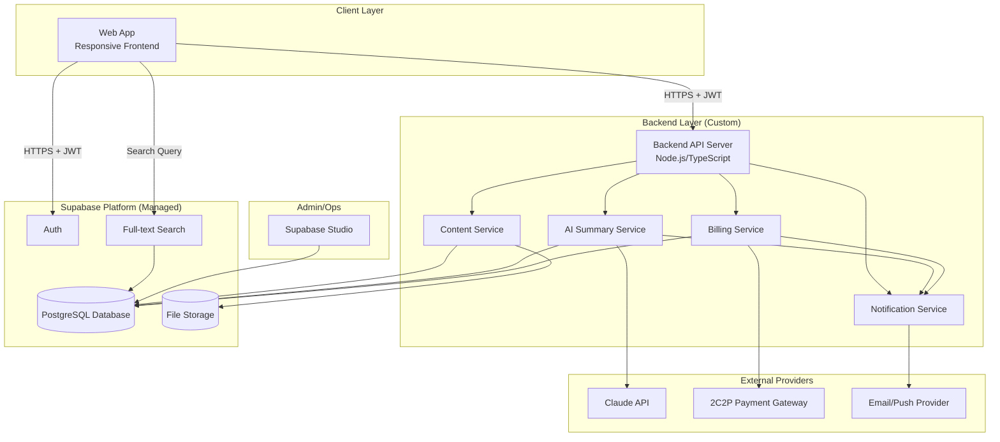
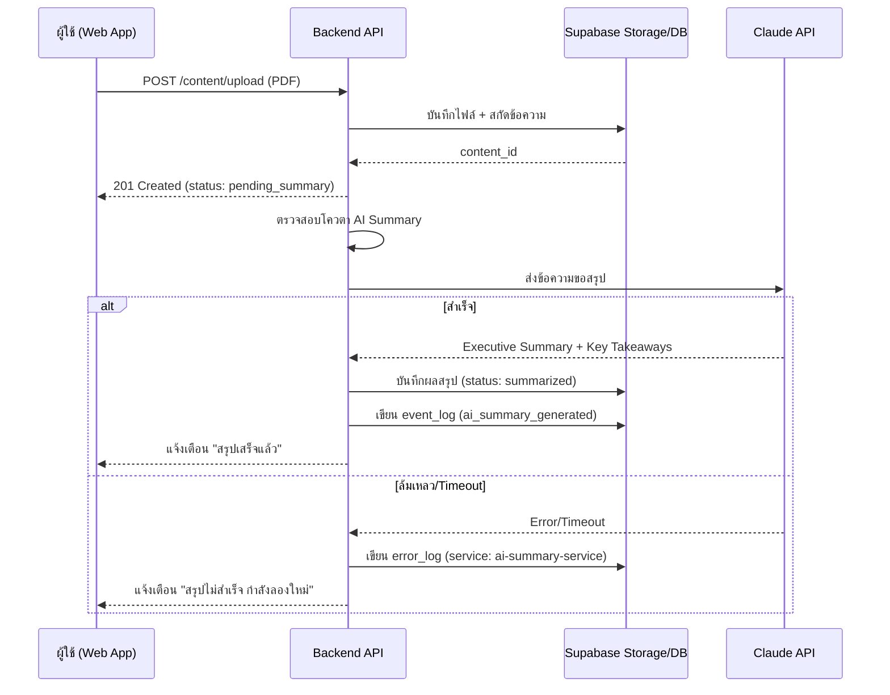
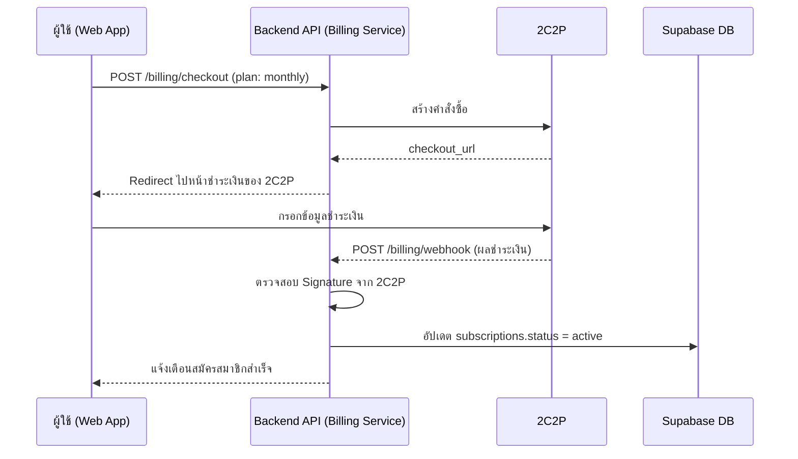
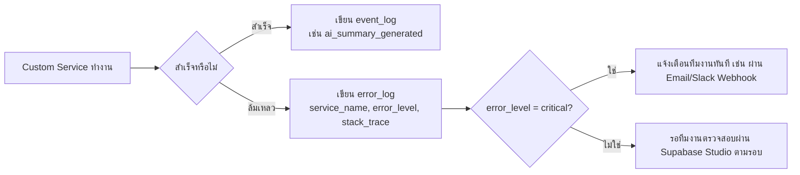
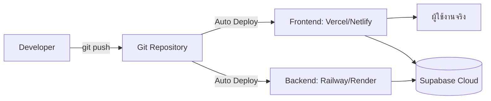

# QriboBook — System Architecture (PoC)

เอกสารนี้สรุปภาพรวมสถาปัตยกรรมทั้งระบบ ผนวกทุกการตัดสินใจจากเอกสารก่อนหน้า (Requirement, Business Flow, Service Architecture, OpenAPI, Database Design) ให้เห็นเป็นภาพเดียว

---

## 1. Tech Stack สรุป

| Layer | เทคโนโลยีที่เลือก | เหตุผล |
|---|---|---|
| Frontend | Web App (Responsive) | ลดต้นทุน ไม่มีค่าคอมมิชชัน Store, ปล่อยอัปเดตได้ทันที |
| Backend | Custom Backend Service (Node.js/TypeScript แนะนำ) + Supabase Edge Functions | เขียนเฉพาะ Logic ที่จำเป็น (Content, AI Summary, Notification, Billing) |
| Database | Supabase (PostgreSQL) | Auth + DB + Storage + Full-text Search ในตัวเดียว |
| Authentication | Supabase Auth | ไม่ต้องสร้าง Auth Service เอง |
| AI Provider | Claude API (Anthropic) | Hallucination ต่ำ เหมาะกับงานสรุปที่ต้องการความถูกต้อง |
| Payment Gateway | 2C2P | รองรับตลาดไทยเต็มรูปแบบ |
| Email/Notification | Email Provider (เช่น Resend/SendGrid) + Web Push API | แจ้งเตือน Reminder, Trial Expiry, Quota Warning |
| API Documentation | OpenAPI 3.0 (Swagger) | ตามที่จัดทำไว้ในไฟล์ openapi.yaml |
| Admin | Supabase Studio | ไม่ต้องสร้าง Admin Panel เอง |
| Logging & Monitoring | Supabase Postgres (`event_log`, `error_log`) | ติดตาม KPI และ Debug Error โดยไม่ต้องเพิ่ม Service ภายนอกในเฟส PoC |

---

## 2. High-level Architecture Diagram

---

## 3. Component Description

### 3.1 Client Layer
- **Web App:** Responsive Web Application รองรับทั้ง Desktop และ Mobile Browser
- สื่อสารกับ Supabase Auth โดยตรงสำหรับ Login/Signup (ใช้ Supabase Client SDK)
- สื่อสารกับ Backend API Server สำหรับ Business Logic ทั้งหมด (Content, AI Summary, Progress, Billing)
- แนบ JWT Token (จาก Supabase Auth) ทุก Request ไปยัง Backend API

### 3.2 Backend API Server
- เป็น Service กลางที่รวม 4 Custom Service (Content, AI Summary, Notification, Billing) ไว้ในโปรเจกต์เดียวสำหรับ PoC (Monolith) — ไม่จำเป็นต้องแยกเป็น Microservices จริงในเฟสนี้ เพราะ Scale ยังเล็ก
- ตรวจสอบ JWT Token ทุก Request (ยกเว้น Webhook Endpoint ที่ใช้ Signature Verification แทน)
- เรียกใช้ Supabase ผ่าน Service Role Key สำหรับ Operation ที่ Client ไม่ควรทำเอง (เช่น อัปเดต Subscription)

### 3.3 Supabase Platform
- **Auth:** จัดการ Session/JWT ทั้งหมด
- **PostgreSQL Database:** ตามที่ออกแบบไว้ใน Database Design Document (11 ตาราง)
- **Storage:** เก็บไฟล์ PDF/EPUB ที่ผู้ใช้อัปโหลด
- **Full-text Search:** ใช้ `tsvector`/GIN Index ในตัว Postgres ไม่ต้องพึ่ง Search Engine แยก

### 3.4 External Providers
- **Claude API:** รับข้อความที่สกัดจากเนื้อหา → คืนค่า Executive Summary + Key Takeaways
- **2C2P:** จัดการ Checkout และส่ง Webhook แจ้งผลชำระเงินกลับมาที่ Billing Service
- **Email/Push Provider:** ส่งการแจ้งเตือนทั้ง 3 ประเภท (Reminder, Trial Expiry, Quota Warning)

### 3.5 Admin/Ops
- **Supabase Studio:** ทีมงานใช้ตรวจสอบผู้ใช้/Subscription/Usage Log โดยตรงผ่าน Dashboard สำเร็จรูป ไม่ต้องพัฒนา Admin Panel เอง

---

## 4. ตัวอย่าง Data Flow สำคัญ

### 4.1 Flow: อัปโหลดเนื้อหา → ได้ AI Summary

### 4.2 Flow: สมัคร Subscription ผ่าน 2C2P

---

## 5. Security Architecture

| ประเด็น | แนวทาง |
|---|---|
| การยืนยันตัวตนผู้ใช้ | Supabase Auth (JWT) — ทุก Request ไปยัง Backend API ต้องแนบ Bearer Token |
| การเข้าถึงข้อมูล | Row Level Security (RLS) บนทุกตาราง — ผู้ใช้เห็นเฉพาะข้อมูลของตัวเอง |
| การเขียนข้อมูลอ่อนไหว (Subscription, Billing, Usage) | เขียนได้เฉพาะผ่าน Backend ด้วย Service Role Key เท่านั้น ไม่เปิดให้ Client เขียนตรง |
| Webhook จาก 2C2P | ตรวจสอบ Signature ทุกครั้งก่อนอัปเดตฐานข้อมูล ป้องกันการปลอมแปลง Webhook |
| การเก็บ API Key | Claude API Key และ 2C2P Secret เก็บเป็น Environment Variable ฝั่ง Backend เท่านั้น ไม่ Expose ให้ Client |
| การเข้ารหัสข้อมูล | HTTPS ทุก Endpoint, Supabase เข้ารหัสข้อมูลที่ Rest โดยอัตโนมัติ |
| ลิขสิทธิ์เนื้อหา | ผู้ใช้ยอมรับ Terms of Use ว่าอัปโหลดเฉพาะเนื้อหาที่ตนมีสิทธิ์ใช้งาน (บันทึกไว้ตอนสมัครสมาชิก) |

---

## 5.1 Logging & Observability

เพื่อให้ทีมงานติดตามได้ว่า **เกิดอะไรขึ้นในระบบ** (Event) และ **เกิด Error เมื่อไหร่/ที่ไหน** (Error) แยกกันชัดเจน ระบบมี 2 ตารางเฉพาะสำหรับ Log:

| ตาราง | ใช้เก็บอะไร | ใครเขียน |
|---|---|---|
| `event_log` | เหตุการณ์ปกติของระบบ เช่น อัปโหลดเนื้อหาสำเร็จ, สร้าง AI Summary สำเร็จ, เริ่ม/สิ้นสุด Trial, ชำระเงินสำเร็จ/ไม่สำเร็จ | ทุก Custom Service เขียนเมื่อ Action สำคัญเกิดขึ้น |
| `error_log` | Error/Exception ที่เกิดขึ้นจริง พร้อม Service ที่เกิด, ระดับความรุนแรง, Stack Trace, และเวลาที่เกิด | ทุก Custom Service เขียนเมื่อ Catch Exception |

**หลักการ:** ทุก Custom Service (Content, AI Summary, Notification, Billing) ต้องมี Middleware/Try-Catch กลางที่ดักจับ Error แล้วเขียนลง `error_log` โดยอัตโนมัติ พร้อมระบุ `service_name`, `error_level`, และ `occurred_at` เพื่อให้ทีมงาน Query ย้อนหลังได้ว่า Error เกิดขึ้นตอนไหน บ่อยแค่ไหน และที่ Service ไหนมากที่สุด

**การใช้งานจริง:**
- ทีมงาน Query `error_log` ผ่าน Supabase Studio โดยกรองด้วย `service_name`, `error_level`, หรือช่วงเวลา `occurred_at` เพื่อสืบหาสาเหตุ
- Query `event_log` เพื่อคำนวณ KPI ตามที่กำหนดไว้ใน Requirement Document (เช่น อัตราการสร้าง AI Summary, อัตราการค้นหา) โดยไม่ต้องพึ่ง Analytics Tool ภายนอกในเฟส PoC
- ตั้งเป้าให้ Error ระดับ `critical` (เช่น Billing Webhook ล้มเหลว, Claude API ล่มต่อเนื่อง) ส่งแจ้งเตือนทีมงานทันทีแทนที่จะรอตรวจสอบตามรอบ — รายละเอียดช่องทางแจ้งเตือน (Email/Slack) ตัดสินใจตอน Implement จริง

---

## 6. Deployment Architecture (แนะนำสำหรับ PoC)

| องค์ประกอบ | ที่แนะนำ | เหตุผล |
|---|---|---|
| Frontend Hosting | Vercel หรือ Netlify | Deploy ง่าย, Free Tier เพียงพอสำหรับ PoC, รองรับ CI/CD จาก Git อัตโนมัติ |
| Backend Hosting | Railway หรือ Render | Deploy Node.js Service ง่าย ราคาประหยัด เหมาะกับทีมเล็ก |
| Database/Storage/Auth | Supabase Cloud | ตามที่ตัดสินใจไว้แล้ว |
| Domain/SSL | ผูกกับ Vercel/Netlify (SSL ออกให้อัตโนมัติ) | ไม่มีค่าใช้จ่ายเพิ่ม |
| Environment | แยก `staging` และ `production` อย่างน้อย 2 Environment | ป้องกันทดสอบ Feature ใหม่กระทบผู้ใช้จริง โดยเฉพาะ Billing |

---

## 7. แนวทางขยายระบบในอนาคต (Post-PoC)

เมื่อผ่าน PoC และตัดสินใจลงทุนเพิ่ม สถาปัตยกรรมนี้รองรับการขยายได้โดยไม่ต้องรื้อทั้งระบบ:

| สิ่งที่จะเพิ่ม | ผลกระทบต่อสถาปัตยกรรม |
|---|---|
| AI Chat with Book (RAG) | เพิ่ม Vector DB (เช่น pgvector ใน Supabase เอง) + Embedding Pipeline ใหม่ ไม่กระทบ Service เดิม |
| Knowledge Graph | เพิ่ม Service ใหม่ที่ประมวลผล Relationship ระหว่างเนื้อหา |
| Mobile App | Backend API เดิมใช้ซ้ำได้ทั้งหมด เพิ่มแค่ Client ใหม่ (Flutter/React Native) |
| Multi-device Real-time Sync | ใช้ Supabase Realtime (มีในตัว Platform อยู่แล้ว) เปิดใช้งานเพิ่มได้ทันที |
| แยก Microservices จริงจัง | เมื่อ Traffic สูงขึ้น ค่อยแยก Backend Monolith ออกเป็น Service อิสระตามที่ระบุไว้ใน Service Architecture Document |

---

## เอกสารที่เกี่ยวข้อง
- `AI-Reading-Learning-Hub-Requirement.md` — Requirement ฉบับเต็ม
- `AI-Reading-Learning-Hub-Business-Flow.md` — Business Flow และ Use Case แต่ละ Module
- `AI-Reading-Learning-Hub-Service-Architecture.md` — รายละเอียด Service และ Endpoint
- `AI-Reading-Learning-Hub-openapi.yaml` — API Specification (Swagger)
- `AI-Reading-Learning-Hub-Database-Design.md` + `AI-Reading-Learning-Hub-initial-db.sql` — โครงสร้างฐานข้อมูล
