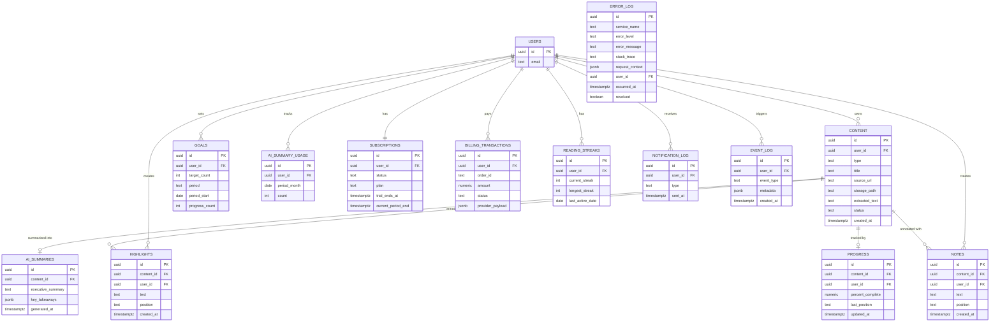

# QriboBook — Database Design (PoC)

ออกแบบสำหรับ PostgreSQL บน Supabase — อ้างอิงจาก Service Architecture และ OpenAPI Specification ที่กำหนดไว้ก่อนหน้า

ตาราง `auth.users` เป็นของ Supabase Auth อยู่แล้ว (สร้างอัตโนมัติเมื่อสมัครสมาชิก) ทุกตารางด้านล่างอ้างอิง `user_id` กลับไปที่ `auth.users(id)`

---

## ER Diagram

---

## รายละเอียดตาราง

### `content`
เก็บเนื้อหาที่ผู้ใช้เพิ่มเข้าระบบ (PDF/EPUB/Article)

| Column | Type | หมายเหตุ |
|---|---|---|
| id | uuid (PK) | |
| user_id | uuid (FK → auth.users) | เจ้าของเนื้อหา |
| type | text | `pdf` \| `epub` \| `article` |
| title | text | |
| source_url | text, nullable | ใช้กับ type = article |
| storage_path | text, nullable | Path ใน Supabase Storage ใช้กับ type = pdf/epub |
| extracted_text | text | ข้อความที่สกัดได้ ใช้ป้อนให้ AI Summary และ Full-text Search |
| status | text | `pending_summary` \| `summarized` |
| created_at / updated_at | timestamptz | |

### `ai_summaries`
ผลสรุปจาก Claude API (ความสัมพันธ์ 1:1 กับ content — สรุปซ้ำจะ Overwrite รายการเดิม)

| Column | Type | หมายเหตุ |
|---|---|---|
| id | uuid (PK) | |
| content_id | uuid (FK → content, unique) | |
| executive_summary | text | |
| key_takeaways | jsonb | Array ของข้อความ เช่น `["...", "..."]` |
| generated_at | timestamptz | |

### `ai_summary_usage`
นับจำนวนครั้งการเรียก AI Summary ต่อผู้ใช้ต่อเดือน ใช้คุม Fair-use Soft Cap (25 ครั้ง, เตือนที่ 18)

| Column | Type | หมายเหตุ |
|---|---|---|
| id | uuid (PK) | |
| user_id | uuid (FK) | |
| period_month | date | เก็บเป็นวันที่ 1 ของเดือน เช่น `2026-07-01` |
| count | int | จำนวนครั้งสะสมในเดือนนั้น |
| Unique constraint | (user_id, period_month) | |

### `highlights` / `notes`
โครงสร้างเหมือนกัน แยกตารางเพื่อให้ Query/Business Logic ชัดเจนขึ้น

| Column | Type | หมายเหตุ |
|---|---|---|
| id | uuid (PK) | |
| content_id | uuid (FK → content) | |
| user_id | uuid (FK) | |
| text | text | ข้อความที่ Highlight หรือ Note |
| position | text | ตำแหน่งอ้างอิง (page/paragraph/offset) |
| created_at | timestamptz | |

### `progress`
ความคืบหน้าการอ่าน (1:1 กับ content)

| Column | Type | หมายเหตุ |
|---|---|---|
| id | uuid (PK) | |
| content_id | uuid (FK → content, unique) | |
| user_id | uuid (FK) | |
| percent_complete | numeric(5,2) | 0–100 |
| last_position | text | |
| updated_at | timestamptz | |

### `goals`
เป้าหมายการอ่านรายเดือน

| Column | Type | หมายเหตุ |
|---|---|---|
| id | uuid (PK) | |
| user_id | uuid (FK) | |
| target_count | int | จำนวนเล่ม/บทความที่ตั้งเป้า |
| period | text | ปัจจุบันรองรับ `monthly` เท่านั้น |
| period_start | date | วันเริ่มต้นของรอบเป้าหมาย |
| progress_count | int | นับอัตโนมัติจากเนื้อหาที่อ่านจบในรอบนั้น |

### `reading_streaks`
Cache ค่า Streak ปัจจุบัน อัปเดตจาก Logic ฝั่ง Backend ทุกครั้งที่มีกิจกรรมการอ่าน

| Column | Type | หมายเหตุ |
|---|---|---|
| id | uuid (PK) | |
| user_id | uuid (FK, unique) | |
| current_streak | int | จำนวนวันติดต่อกัน |
| longest_streak | int | สถิติสูงสุด |
| last_active_date | date | ใช้เช็คว่า Streak ขาดหรือยัง |

### `subscriptions`
สถานะ Subscription ของผู้ใช้ (1 คนมี 1 แถว เพราะ Tier เดียว)

| Column | Type | หมายเหตุ |
|---|---|---|
| id | uuid (PK) | |
| user_id | uuid (FK, unique) | |
| status | text | `trial` \| `active` \| `expired` \| `cancelled` |
| plan | text, nullable | `monthly` \| `yearly` |
| trial_ends_at | timestamptz | กำหนดตอนสมัครสมาชิก = created_at + 7 วัน |
| current_period_end | timestamptz, nullable | วันหมดรอบบิลปัจจุบัน (กรณี Active) |
| created_at / updated_at | timestamptz | |

### `billing_transactions`
บันทึกทุกธุรกรรมจาก 2C2P (Webhook)

| Column | Type | หมายเหตุ |
|---|---|---|
| id | uuid (PK) | |
| user_id | uuid (FK) | |
| order_id | text, unique | ใช้ Match กับ Webhook ที่ส่งกลับมา |
| amount | numeric(10,2) | |
| currency | text | default `THB` |
| status | text | `pending` \| `success` \| `failed` |
| provider | text | default `2c2p` |
| provider_payload | jsonb | เก็บ Raw Payload จาก Webhook ไว้ตรวจสอบย้อนหลัง |
| created_at | timestamptz | |

### `notification_log`
บันทึกการแจ้งเตือนที่ส่งไปแล้ว ป้องกันส่งซ้ำ

| Column | Type | หมายเหตุ |
|---|---|---|
| id | uuid (PK) | |
| user_id | uuid (FK) | |
| type | text | `reminder` \| `trial_expiry` \| `quota_warning` |
| sent_at | timestamptz | |

### `event_log`
บันทึกเหตุการณ์สำคัญของระบบ ใช้ติดตาม KPI (ตามที่กำหนดไว้ใน Requirement Document) และวิเคราะห์พฤติกรรมผู้ใช้ย้อนหลัง — ไม่ใช่ตารางสำหรับ Error แต่เป็น "สิ่งที่เกิดขึ้นแล้ว" ในระบบ

| Column | Type | หมายเหตุ |
|---|---|---|
| id | uuid (PK) | |
| user_id | uuid (FK), nullable | บาง Event เป็นของระบบล้วนๆ ไม่ผูกกับผู้ใช้ |
| event_type | text | เช่น `content_uploaded`, `ai_summary_generated`, `ai_summary_failed`, `quota_warning_triggered`, `quota_cap_reached`, `highlight_created`, `note_created`, `goal_created`, `search_performed`, `trial_started`, `trial_expired`, `subscription_started`, `subscription_cancelled`, `payment_success`, `payment_failed` |
| metadata | jsonb | ข้อมูลบริบทเพิ่มเติม เช่น `{"content_id": "..."}` |
| created_at | timestamptz | |

### `error_log`
บันทึก Error ของระบบ เพื่อ Debug และติดตามความเสถียรของแต่ละ Service — แยกจาก `event_log` เพราะมี Field เฉพาะสำหรับ Debug (Stack Trace, Request Context, สถานะการแก้ไข)

| Column | Type | หมายเหตุ |
|---|---|---|
| id | uuid (PK) | |
| service_name | text | เช่น `content-service`, `ai-summary-service`, `annotation-service`, `progress-service`, `notification-service`, `billing-service` |
| error_level | text | `info` \| `warning` \| `error` \| `critical` |
| error_message | text | |
| stack_trace | text, nullable | |
| request_context | jsonb, nullable | เช่น `{"endpoint": "/ai/summarize", "method": "POST"}` |
| user_id | uuid (FK), nullable | ผู้ใช้ที่เกี่ยวข้องกับ Error นั้น (ถ้ามี) |
| occurred_at | timestamptz | เวลาที่เกิด Error — ใช้ Query ย้อนหลังเพื่อดูว่า Error เกิดตอนไหน |
| resolved | boolean | ทีมงานอัปเดตเป็น `true` เมื่อแก้ไขแล้ว |
| resolved_at | timestamptz, nullable | |

---

## Full-text Search

ใช้ PostgreSQL Full-text Search ผ่าน Generated Column + GIN Index บนตาราง `content`, `highlights`, `notes` (ดูรายละเอียดใน SQL) — Search Service (ตาม OpenAPI `/search`) จะ Query ทั้ง 3 ตารางแล้วรวมผลลัพธ์

## Row Level Security (RLS)

ทุกตารางเปิด RLS และมี Policy พื้นฐานเดียวกัน: **ผู้ใช้เข้าถึงได้เฉพาะแถวที่ `user_id = auth.uid()` ของตัวเอง** ยกเว้น:
- `ai_summaries` ตรวจสอบผ่าน `content.user_id` (Join กับตาราง content เพราะไม่มี user_id ตรงตัว)
- Webhook Endpoint (`/billing/webhook`) เขียนข้อมูลผ่าน Service Role Key (Bypass RLS) เพราะเป็น Server-to-server ไม่มี User Session
- **`event_log` และ `error_log` ไม่เปิด Policy ให้ Client เข้าถึงเลยโดยเจตนา** — เขียน/อ่านได้เฉพาะผ่าน Backend ด้วย Service Role Key เท่านั้น เพราะเป็นข้อมูล Internal สำหรับทีมงาน ไม่ใช่ข้อมูลที่ผู้ใช้ควรเห็นโดยตรง ทีมงานดูผ่าน Supabase Studio ซึ่งเชื่อมต่อด้วยสิทธิ์ Superuser อยู่แล้ว

## Triggers

- `updated_at` ทุกตารางที่มีคอลัมน์นี้ อัปเดตอัตโนมัติผ่าน Trigger `set_updated_at()`
- เมื่อสมัครสมาชิกใหม่ (Insert ใน `auth.users`) ควรมี Trigger สร้างแถวเริ่มต้นใน `subscriptions` (status = `trial`, trial_ends_at = now() + 7 วัน) โดยอัตโนมัติ — รายละเอียดอยู่ใน SQL ไฟล์แนบ
